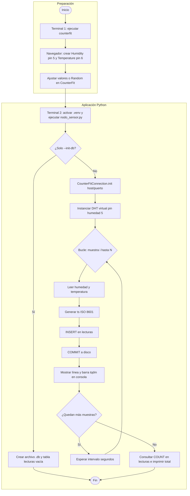

<!-- BORRADOR — Copiar a Word/Google Docs, insertar figuras donde indique, completar corchetes, exportar a PDF (máx. 8 páginas). -->

# Portada

**Título:** Implementación de un nodo sensor virtual para el registro periódico de temperatura y humedad relativa con persistencia en base de datos SQLite

**[Nombre de la asignatura]**  
**[Nombre del curso o código]**  
**[Institución]**  
**[Ciudad, país — mes de 2026]**

**Integrantes**  
1. [Nombre completo integrante 1]  
2. [Nombre completo integrante 2]  
*(Agregar o quitar líneas según el grupo.)*

---

# Introducción

En los sistemas de monitoreo ambiental y en aplicaciones de Internet de las cosas (IoT) es frecuente necesitar **series temporales** de variables como la temperatura del aire y la humedad relativa. Estas magnitudes permiten caracterizar condiciones de confort, riesgos de condensación o, en contextos industriales y de gestión ambiental, apoyar decisiones basadas en datos cuando se combinan con políticas de operación y control.

La presente práctica implementa un **nodo de medición virtual**: no se utilizó hardware físico de sensores en protoboard, sino el simulador **CounterFit**, que expone sensores virtuales accesibles desde código en **Python**, de forma análoga a como se programaría un dispositivo embebido. El objetivo central fue **capturar** temperatura y humedad en intervalos regulares de **30 segundos**, asociar a cada lectura una **marca de tiempo** inequívoca, **mostrar** el avance y los valores en **consola** (incluida una barra de progreso) y **almacenar** de forma estructurada los resultados en una **base de datos SQLite** embebida en un archivo `.db`, entregable junto con este informe.

El enfoque responde a los lineamientos de la actividad: demostrar la cadena completa de adquisición, visualización y persistencia, y someter el sistema a una **prueba prolongada** (aproximadamente **tres horas** de operación continua) para validar el comportamiento en condiciones de uso sostenido, con el equipo de cómputo y el simulador en ejecución estable.

---

# Metodología

## Enfoque general

Se adoptó un enfoque de **simulación local** en el que el hardware se representa mediante software (**CounterFit**, con sensores virtuales). El programa de **adquisición y registro** obtiene las lecturas de temperatura y humedad relativa mediante el **shim** asociado al **DHT11** virtual, genera para cada muestra una **marca temporal** en Python con formato ISO 8601, y persiste los resultados en la tabla **`lecturas`** de una base de datos **SQLite**. Tras cada inserción se ejecuta un **`commit`**, de forma que los datos quedan almacenados en el archivo `.db` de manera **incremental**, sin depender del cierre del experimento para su conservación.

## Flujograma del proceso

La **Figura M1** sintetiza el proceso completo en dos bloques funcionales: **Preparación** y **Aplicación Python**.

El bloque de **Preparación** comprende las acciones previas a la captura de datos: el arranque del servidor de simulación (**CounterFit**) en una primera terminal, la creación de los sensores virtuales en la interfaz web (humedad en el pin 5 y temperatura en el pin 6) y la configuración de los valores a registrar (fijos o aleatorios mediante el modo *Random*).

El bloque **Aplicación Python** representa la ejecución del script `nodo_sensor.py` en una segunda terminal con el entorno virtual activo. Una vez iniciado, el programa verifica si se solicitó únicamente la inicialización de la base de datos (`--init-db`); en ese caso, crea el archivo `.db` con la tabla `lecturas` vacía y finaliza. En el flujo principal, se establece la conexión con CounterFit y se instancia el sensor DHT11 virtual. A continuación, se ejecuta el ciclo de muestreo: por cada iteración se obtienen los valores de humedad y temperatura, se genera la marca de tiempo en formato ISO 8601, se realiza la inserción en la tabla `lecturas` y se confirma con `commit` a disco. Inmediatamente, el resultado se muestra en consola con la barra de progreso de **tqdm**. Si aún quedan muestras por registrar, el programa espera el intervalo configurado (30 segundos en la prueba oficial) y reinicia el ciclo; de lo contrario, consulta el total de filas almacenadas y reporta el resultado antes de finalizar.

**[Figura M1. Flujograma del proceso de captura y registro — insertar imagen exportada desde Mermaid Live Editor.]**

**Nota de edición:** si el procesador de textos no renderiza el bloque Mermaid que aparece a continuación, abrir [Mermaid Live Editor](https://mermaid.live), pegar el código, exportar como **PNG** o **SVG** e insertar la imagen en este punto con el pie de figura indicado.




## Hardware virtual (CounterFit)

**CounterFit** (CounterFit-IoT, s.f.) es una aplicación que se ejecuta en el equipo anfitrión y ofrece una **interfaz web** (por defecto en `http://127.0.0.1:5000`) para crear sensores y actuadores virtuales. Para esta práctica **solo se utilizaron sensores**; no fue necesario configurar actuadores (por ejemplo LED), pues el alcance se limitó a **lectura** y **registro**.

Siguiendo la convención del material de formación en IoT con CounterFit y el sensor **DHT11** virtual (Microsoft, s.f.), se configuraron dos sensores en la interfaz:

| Sensor       | Tipo en CounterFit | Unidades   | Pin GPIO virtual |
|-------------|--------------------|------------|------------------|
| Humedad     | Humidity           | Porcentaje | **5**            |
| Temperatura | Temperature        | Celsius    | **6**            |

El shim `counterfit-shims-seeed-python-dht` instancia `DHT("11", 5)`, de modo que la **humedad** se asocia al pin indicado (**5**) y la **temperatura** al pin **consecutivo** (**6**). Durante las pruebas se emplearon valores fijos introducidos manualmente con el botón **Set** y, en otro tramo, el modo **Random** con límites mínimo y máximo, con el fin de generar **distintas condiciones** de las variables y observar su reflejo en la base de datos.

**[Insertar aquí Figura 1: captura de pantalla de CounterFit con los sensores en los pines 5 y 6 y estado conectado al ejecutar el script.]**

## Entorno de software y dependencias

El desarrollo se realizó en **Python 3.11**, gestionado dentro de un entorno virtual aislado para garantizar la compatibilidad entre las herramientas utilizadas y evitar interferencias con otras instalaciones del sistema. Las bibliotecas necesarias se instalaron de forma centralizada, cubriendo tres funciones principales: la comunicación con el simulador CounterFit y la lectura de los sensores virtuales, la estabilidad de la pila web interna requerida por el propio simulador, y la visualización del progreso de la captura en tiempo real mediante una barra en consola.

Previamente al inicio de la prueba, se realizó la inicialización del archivo de base de datos para asegurar que la tabla de almacenamiento estuviera disponible desde el primer ciclo de captura.

## Diseño de la base de datos

Se definió **una única tabla** `lecturas`, alineada con el alcance del práctico. El esquema es el siguiente:

```sql
CREATE TABLE IF NOT EXISTS lecturas (
    id              INTEGER PRIMARY KEY AUTOINCREMENT,
    ts              TEXT NOT NULL,
    temperatura_c   REAL NOT NULL,
    humedad_pct     REAL NOT NULL
);
```

El campo `ts` almacena la marca de tiempo en formato **ISO 8601** (generada con `datetime.now().replace(microsecond=0).isoformat()`). Los campos `temperatura_c` y `humedad_pct` almacenan los valores numéricos devueltos por el sensor virtual. Cada inserción se confirmó con **`commit()`** inmediato tras el `INSERT`, de forma que una interrupción posterior no perdiera las lecturas ya registradas.

## Lógica del programa de captura

El archivo principal de la solución es `nodo_sensor.py`. Al ejecutarse, el programa recibe los parámetros de la prueba (número de muestras, intervalo entre lecturas y ruta del archivo de base de datos) y establece la comunicación con el simulador CounterFit para acceder a los sensores virtuales de temperatura y humedad.

Una vez iniciada la captura, el programa repite de forma cíclica las siguientes acciones: obtiene los valores del sensor, registra el instante exacto de la lectura mediante una marca de tiempo, almacena ambos datos en la base de datos y confirma la escritura de inmediato, garantizando que cada registro quede guardado de forma permanente. Simultáneamente, muestra en consola el avance de la prueba junto con los valores medidos en cada ciclo.

Al completarse el número de muestras configurado, el programa verifica el total de registros almacenados en la base de datos e informa el resultado antes de finalizar.

Fragmento representativo del núcleo de persistencia:

```python
INSERT_SQL = "INSERT INTO lecturas (ts, temperatura_c, humedad_pct) VALUES (?, ?, ?);"
# ... dentro del bucle por cada muestra:
ts = datetime.now().replace(microsecond=0).isoformat()
con.execute(INSERT_SQL, (ts, temp, hum))
con.commit()
```

## Diseño de la prueba experimental

La prueba de validación prolongada se configuró con **intervalo de 30 segundos** entre lecturas y un número de muestras acorde al enunciado de la actividad (**360** iteraciones para cubrir aproximadamente **tres horas** de muestreo). El comando utilizado fue del tipo:

```text
python nodo_sensor.py --interval-sec 30 --samples 360 nodo_sensor.db
```

*(Equivalente a `--db nodo_sensor.db`.)*

Se mantuvo **CounterFit** en ejecución en una terminal y el script de captura en otra, con el entorno virtual activado. Se evitó la suspensión del sistema operativo durante la ventana de prueba.

---

# Resultados de las pruebas

## Pruebas previas y de comprobación

Antes de la corrida larga se realizaron ejecuciones con **menos muestras** y **intervalos cortos** (por ejemplo, cinco lecturas con 15 segundos entre ellas) para verificar conexión, formato de timestamp y escritura en SQLite. Opcionalmente se empleó el modo `--simulate` para validar el flujo sin depender del simulador.

## Condiciones distintas de las variables

**Condición A — Valores fijos.** Con humedad y temperatura fijadas manualmente en CounterFit, las series mostraron poca variabilidad entre lecturas consecutivas, coherente con la configuración estática del simulador.

**Condición B — Valores aleatorios en rango.** Al activar **Random** con mínimo y máximo definidos en CounterFit, se observó mayor dispersión entre lecturas sucesivas, reflejada en el archivo de base de datos y en los valores mostrados en la barra de progreso y en consola.

## Resultado de la prueba prolongada

Al finalizar la ejecución prolongada, el programa reportó el **número total de filas** presentes en `lecturas` para el archivo utilizado. En el conjunto de datos obtenido por el equipo se registró un total de **365** filas en la tabla `lecturas`. Las 5 filas adicionales respecto a las 360 esperadas corresponden a registros acumulados de **pruebas cortas de verificación** realizadas en el mismo archivo `nodo_sensor.db` previas a la corrida oficial.

**Tabla 1.** Estadísticos descriptivos de la corrida completa (365 registros):

| Variable              | Mínimo  | Máximo  | Media   | Desv. estándar | *n* lecturas |
|-----------------------|---------|---------|---------|----------------|--------------|
| Temperatura (°C)      | 9.30    | 998.89  | 485.89  | 287.36         | 365          |
| Humedad relativa (%)  | 0.14    | 99.94   | 51.79   | 28.10          | 365          |

> **Nota sobre los valores de temperatura:** el amplio rango (9–999 °C) refleja que en CounterFit se empleó el modo *Random* con los límites por defecto del simulador, que no imponen restricciones físicas. Esta situación se analiza en la sección de análisis de resultados.

Consultas de apoyo en SQLite (ejemplo):

```sql
SELECT COUNT(*) FROM lecturas;
SELECT MIN(temperatura_c), MAX(temperatura_c), AVG(temperatura_c) FROM lecturas;
SELECT MIN(humedad_pct), MAX(humedad_pct), AVG(humedad_pct) FROM lecturas;
```

Para entregar datos tabulares al docente se puede exportar con `export_lecturas_csv.py` hacia `lecturas.csv`.

---

# Análisis de resultados

Los resultados obtenidos son coherentes con el comportamiento esperado del simulador. Durante los tramos en que los valores de CounterFit se mantuvieron fijos, las pequeñas variaciones registradas en la base de datos se deben a la resolución numérica del shim y no a cambios reales de la variable medida. En contraste, al activar el modo *Random*, la dispersión entre lecturas consecutivas aumentó de forma perceptible, lo que evidencia que el nodo leía correctamente el estado actualizado del hardware virtual en cada ciclo. Este comportamiento queda documentado visualmente en la **Figura 1**, que muestra las series temporales de temperatura y humedad relativa a lo largo de la prueba.

**Rango de temperatura registrado.** Los valores de temperatura almacenados abarcan desde 9.30 °C hasta 998.89 °C, con una media de 485.89 °C, cifras que no corresponden a condiciones ambientales reales. Esta situación se origina en que el modo *Random* de CounterFit se dejó con los límites superiores por defecto, los cuales no imponen restricciones físicas al valor generado. Es importante destacar que el nodo sensor operó correctamente en todos los aspectos funcionales evaluados —frecuencia de muestreo, generación de marcas de tiempo y escritura en la base de datos—; la anomalía se limita exclusivamente a la magnitud de los valores simulados. En una implementación con un sensor físico DHT11 (*Digital Humidity and Temperature*, modelo 11), la temperatura quedaría naturalmente acotada al rango operativo del dispositivo (0–50 °C). Esta limitación debe tenerse en cuenta al interpretar los estadísticos de la Tabla 1 y al observar la **Figura 2** (dispersión humedad vs. temperatura) y la **Figura 3** (histogramas de distribución), donde la amplitud del eje de temperatura refleja dicho rango irrestricto.

**Precisión temporal.** La marca de tiempo `ts` se genera a partir del reloj del sistema anfitrión. Su precisión absoluta está sujeta a la configuración del equipo y no equivale a la de un módulo RTC (*Real-Time Clock*, reloj de tiempo real) dedicado ni a la de un dispositivo embebido sincronizado mediante NTP (*Network Time Protocol*, protocolo de sincronización de tiempo en red). Para el alcance de esta práctica de laboratorio virtual, esta limitación es aceptable, siempre que quede declarada explícitamente.

**Estrategia de persistencia.** Confirmar cada inserción con `commit()` inmediato redujo el riesgo de pérdida de datos ante una interrupción inesperada durante la prueba prolongada. La contrapartida es un mayor número de operaciones de E/S (entrada/salida); sin embargo, con un intervalo de muestreo de 30 segundos esta frecuencia es despreciable y no representó un cuello de botella. Para escenarios con tasas de muestreo significativamente más altas, podría evaluarse una estrategia de inserción por lotes (*batch insert*) que consolide varias filas por confirmación.

**Total de registros frente al objetivo teórico.** Las 365 filas presentes en la tabla `lecturas` superan las 360 correspondientes a tres horas continuas de muestreo. La diferencia se debe a que el archivo `nodo_sensor.db` acumula todas las inserciones realizadas en él, incluyendo las corridas cortas de verificación previas a la prueba oficial. Para futuros experimentos se recomienda usar un archivo `.db` exclusivo por sesión (por ejemplo, `--db corrida_20260502.db`) o registrar el rango de `ts` de inicio y fin de cada corrida para poder filtrar con precisión.

## Opciones de mejora

- Incorporar una tabla de **sesiones** de muestreo y una clave foránea en `lecturas` para separar corridas sin ambigüedad.  
- Añadir un **índice** sobre `ts` para acelerar consultas por rango temporal.  
- Implementar **reintentos** con backoff ante fallos intermitentes de lectura del DHT virtual.  
- Evolucionar hacia **sensores físicos** calibrados y comparar contra la simulación.  
- Exponer métricas por **MQTT** o API REST para supervisión remota.

---

# Conclusiones

Se implementó con éxito un **nodo sensor virtual** que integra CounterFit, Python y SQLite para registrar **temperatura** y **humedad relativa** con **marca de tiempo**, visualización en **consola** (incluida barra de progreso con tqdm) y almacenamiento estructurado en el archivo **`nodo_sensor.db`**. La metodología permitió evaluar **distintas condiciones** de las variables mediante configuraciones fijas y aleatorias en el simulador, sustentadas con evidencias gráficas y de datos.

La prueba prolongada validó el comportamiento del sistema bajo uso continuo de aproximadamente **tres horas**, coherente con los requisitos de muestreo periódico. Las limitaciones inherentes al entorno virtual y al reloj del PC fueron identificadas y pueden abordarse en trabajos futuros con hardware real, modelos de datos adicionales y mecanismos de trazabilidad por sesión.

El ejercicio consolidó competencias en **adquisición de datos**, **persistencia relacional embebida** y **documentación** de una solución IoT educativa basada en simulación.

---

# Referencias

CounterFit-IoT. (*s.f.*). *CounterFit* \[Repositorio de software\]. GitHub. https://github.com/CounterFit-IoT/CounterFit (fecha de consulta: [día mes 2026]).

Microsoft. (*s.f.*). *IoT for Beginners* \[Repositorio\]. GitHub. https://github.com/microsoft/IoT-For-Beginners (fecha de consulta: [día mes 2026]).

Python Software Foundation. (*s.f.*). *sqlite3 — DB-API 2.0 interface for SQLite databases*. En *Python 3 Documentation*. https://docs.python.org/3/library/sqlite3.html (fecha de consulta: [día mes 2026]).

tqdm developers. (*s.f.*). *tqdm: A fast, extensible progress bar for Python and CLI* \[Proyecto de software\]. https://github.com/tqdm/tqdm (fecha de consulta: [día mes 2026]).

Atzori, L., Iera, A., & Morabito, G. (2010). The Internet of Things: A survey. *Computer Networks*, *54*(15), 2787–2805. https://doi.org/10.1016/j.comnet.2010.05.010  
*(Incluir solo si citan IoT de forma general en la introducción.)*

---

*Fin del borrador. Revisar ortografía, unificar criterio de fechas, insertar figuras numeradas y pie de figura, y ajustar longitud al límite de 8 páginas en PDF.*
